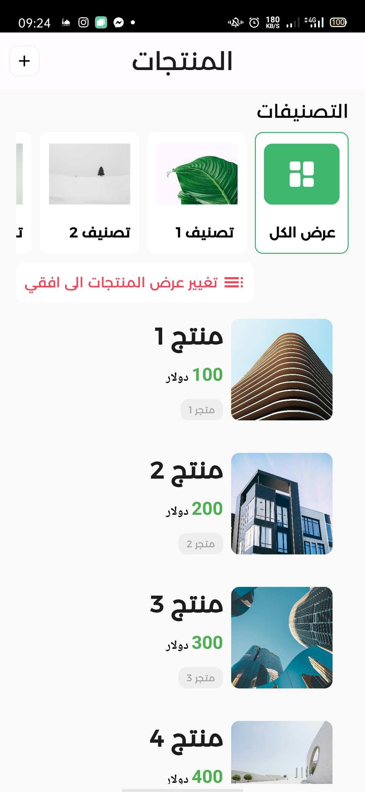
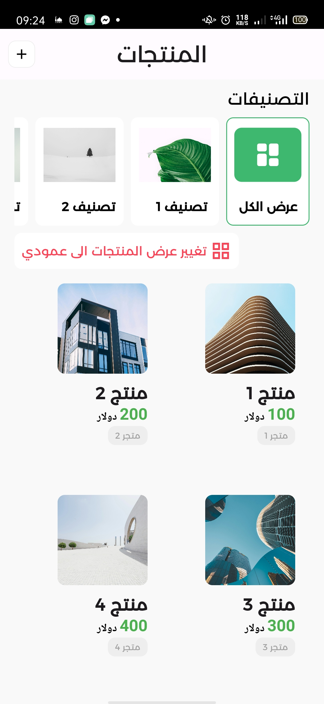
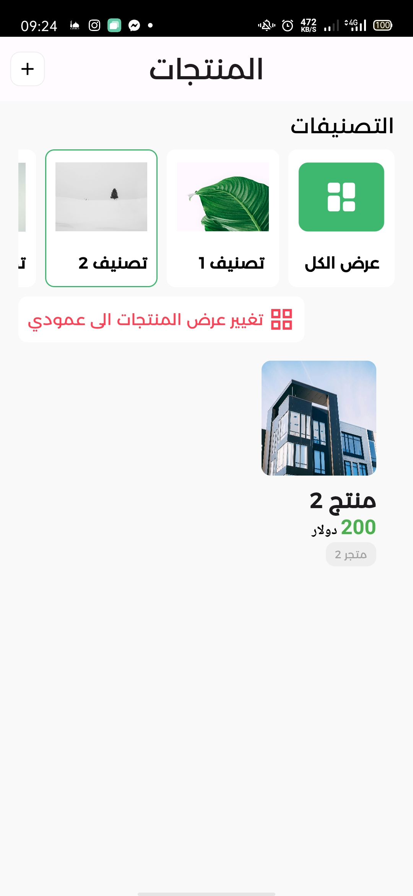
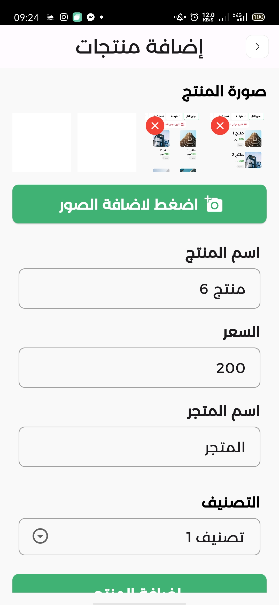

## Jaksi-Task-App

- This is a simple task app i made for the Jaksi Interview, it is a simple task app that allows you to add,Get Products, filter them , and change the list , add images ... ect

## Screenshots

<div style="display:flex; flex-wrap: wrap; justify-content: center;">
  




</div>


## Features
- Add Product
- Get Products
- Filter Products
- Change View Style
- Add Images
- Products Stored in Local Storage

## Dependencies

``` yaml
dependencies:
  flutter_svg: ^2.0.10+1
  image_picker: ^1.1.1
  shared_preferences: ^2.2.3
  flutter_riverpod: ^2.5.1
  hooks_riverpod: ^2.5.1
  flutter_hooks: ^0.20.5
```

## How To Run

- Clone the project

```bash
git clone

cd jaksi_task_app
```

- Install the dependencies

```bash
flutter pub get
```

- Run the app

```bash
flutter run
```

## Author

- [1FarZ1](https://github.com/1farz1)
